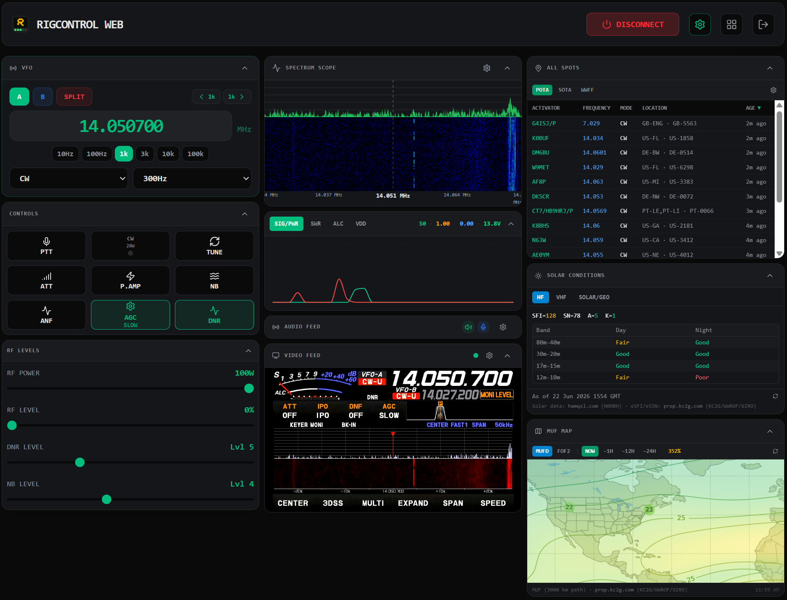

# RigControl Web

A web-first app for controlling your radio and making CW and SSB contacts!  

- Full support for making voice and CW contacts, plus FT8/FT4/WSPR and other digital modes via the WSJTX Bridge.
  
- CW keyer in iambic and straight modes (via keyboard, "vBand adapter", or Tiny MIDI).  You can send real CW!  Not macros!
  
- Audio via your radio's virtual USB Audio Device, Digirig or similar.
  
- Spectrum scope available on supported Icom radios (IC-7300, IC-7300MK2, IC-7610, IC-7850/7851, IC-705, IC-9700, IC-905), the Yaesu FT-710, and — via a generic Audio I/Q source over any USB audio interface — the Xiegu G90.
  
- Video support so you can see the front panel of your radio (by feeding DVI/HDMI into your PC with an HDMI to USB capture dongle).

## Getting Started

**Most users should download the latest pre-built installer from the [Releases page](https://github.com/jbdubbs/Rig-Control-Web/releases).** Pick the installer for your operating system (Windows `.exe`, Linux `.AppImage`, or macOS `.dmg`), run it, and you are ready to go — no Node.js, no build tools required.

**Running on a dedicated Raspberry Pi or mini PC?** See [Headless Deployment](https://github.com/jbdubbs/Rig-Control-Web/wiki/Headless-Deployment) for Docker Compose, `docker run`, and systemd options — no display or Electron required.

For full usage instructions, see the **[Wiki](https://github.com/jbdubbs/Rig-Control-Web/wiki)**.

## Screenshots

### Compact View (Desktop)


### Phone View (Mobile)


## Features

- **Remote Access**: Access your shack from anywhere over your own VPN (or via not-included reverse proxy) by pointing a browser to your rig computer's IP on port 3000. (e.g. https://192.168.1.2:3000)
- **User Authentication**: Run a remote rig for your club or group.  Schools can allow remote access to a radio for those who don't have one.  Or, just lock down access for you alone on your home radio.

- **Split VFO Support**: Full control over split operations with visual feedback.
- **Real-time Graphing**: Frequency, mode, and meter displays (S-Meter, SWR, ALC, Power, VDD) polled live from the rig.
- **Spectrum Scope**: Live panadapter and waterfall display. Three sources: Hamlib UDP multicast (Icom IC-7300, IC-7300MK2, IC-7610, IC-7850/7851, IC-705, IC-9700, IC-905), direct USB-SPI on the Yaesu FT-710 (without SCU-LAN10), or a generic Audio I/Q source that captures baseband I/Q through any USB audio interface — tested against the Xiegu G90.
- **Rig Video Feed**: Display a system video capture device (e.g. HDMI capture card or webcam) so you can see your radio's front panel remotely. Example: FT-710 DVI out → USB HDMI capture card.
- **Bidirectional Audio**: Full transmit and receive audio from your radio to your remote browser window.

- **CW Keyer**: Full iambic (A/B) and straight-key CW keying from any browser.  Use keyboard keys, a TinyMIDI, or a vBand adapter.
- **CW Decoder**: Real-time Morse code decoding of received audio using the [GGMorse](https://github.com/ggerganov/ggmorse) library.

- **WSJTX Bridge (Remote Digital Modes)**: Operate FT8, FT4, WSPR, and other digital modes with WSJT-X while controlling your radio remotely through RigControl Web. A small helper binary (`wsjtx-bridge`) runs on your local operating machine, bridging WSJT-X's rig control to RigControl Web over your existing browser connection and auto-configuring virtual audio devices for RX/TX. See the [WSJTX Integration wiki page](https://github.com/jbdubbs/Rig-Control-Web/wiki/WSJTX-Integration) for setup.

- **Live Spots (POTA, SOTA, WWFF)**: Real-time spot displays with filtering by mode and frequency.
  - Click any spot to instantly tune the VFO and set the mode.
- **Solar & Propagation Data**: Live HF band conditions, VHF propagation alerts, and detailed solar indices from [hamqsl.com](https://www.hamqsl.com/) (N0NBH).
- **MUF / foF2 World Map**: Zoomable SVG world propagation map embedded from [prop.kc2g.com](https://prop.kc2g.com/).

- **Works With All Hamlib-Compatible Software (Local Digital Modes)**: When working from the same PC as your installed RigControl Web software, apps like WSJTX work perfectly.  No need to only have one open at a time.

## Prerequisites

### Common
- **Operating Systems**:
  - **Windows 10 or higher** (tested on Windows 11 23H2) — The Electron installer includes a bundled `rigctld`.
  - **Linux kernel 6.0 or higher** (tested on Fedora 43) — The Electron AppImage includes a bundled `rigctld`.
  - **macOS** — Completely untested.  No testing hardware.

### Compile from Source
- **Node.js**: Version 24 or higher.
- **Hamlib**: 4.7.0 or higher.
  - **Electron Apps**: A bundled `rigctld` is auto-provisioned at build time by `scripts/build-rigctld.mjs` (runs as part of `npm run electron:build`). It will skip the build if a binary is already present in `bin/[linux|windows|mac]/`. The app falls back to the system `rigctld` if no bundled binary is found.

### Installing Hamlib (only if compiling from source, 4.7.0 or higher)
- **Linux**: `sudo apt install libhamlib-utils`, `sudo dnf install hamlib`
  - **WARNING**: Most Linux distros, including extremely modern ones seem to still be bundling Hamlib 4.6.5 (as of May 2026).  This will NOT work.  Install from the Hamlib GitHub page. [Hamlib website](https://hamlib.github.io/)
- **macOS**: `brew install hamlib`
- **Windows**: Download and install from the [Hamlib website](https://hamlib.github.io/).

## Development

1. Install dependencies:
   ```bash
   npm install
   ```
2. Start the web server in development mode:
   ```bash
   npm run dev
   ```
3. Open [https://localhost:3000](https://localhost:3000) in your browser.

### Desktop App (Electron)

RigControl Web can be run as a native desktop application.

#### Run in Development
```bash
npm run electron:dev
```

#### Build for Production

##### Windows (NSIS Installer)
```bash
npm run electron:build -- --win
```

##### Linux (AppImage)
```bash
npm run electron:build -- --linux
```

###### Linux GNOME Desktop Integration (AppImage)

To add RigControl Web to your GNOME application menu with the correct icon and taskbar association, run the AppImage once with `--install`:

```bash
./RigControl-Web-<version>.AppImage --install
```

This copies the app icon to `~/.local/share/icons/` and writes a `.desktop` entry to `~/.local/share/applications/`. The AppImage itself is not moved — keep it wherever you like.

To remove the desktop integration:

```bash
./RigControl-Web-<version>.AppImage --uninstall
```

##### macOS (DMG Installer, arm64)
```bash
npm run electron:build -- --mac --arm64
```

Built installers are placed in the `build/` directory.

### Diagnostic Logging

See the [Diagnostic Logging wiki page](https://github.com/jbdubbs/Rig-Control-Web/wiki/Diagnostic-Logging) for `--debug-*` flags and how to capture logs for a bug report.

## License

Apache-2.0. See [LICENSE.md](LICENSE.md) for the full license text and third-party dependency licenses.
